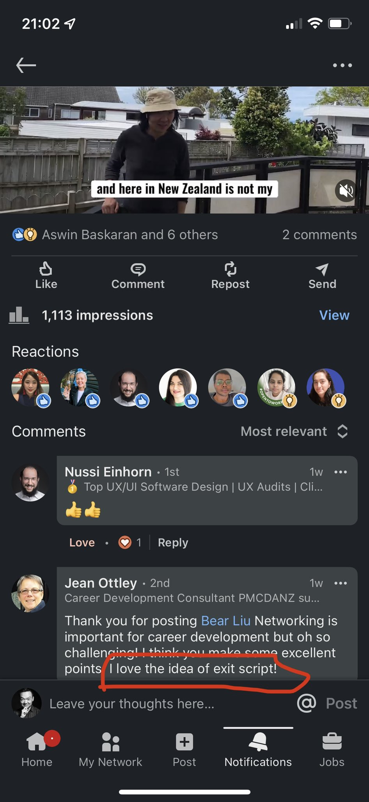
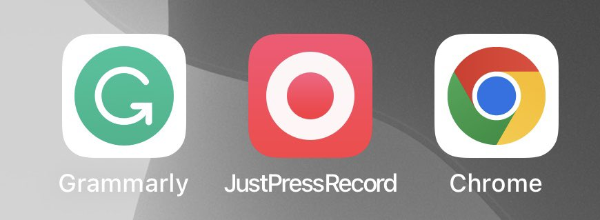

## 

To view keyboard shortcuts, press question mark

[View keyboard shortcuts](https://twitter.com/i/keyboard_shortcuts)

## Thread

## Conversation

12 / 我是内向型人，本来social就是我的弱项，刚到国外时还跑去一个传媒界的晚会，我的天，简直社死现场。不知道自己该干嘛，没有认识的人，不知道和谁说话，不知道说些什么。但现在我总结出了经验了，根本不怕社交。最核心的就是不要在意自己，发自内心滴对别人好奇，注意力集中在别人身上。具体是：

13 / 准备最简单的自我介绍，然后马上提问，把话题转到对方，并且不断追加互动。比如我在取餐时视线和某人相遇，就大方地说一句hi there。看肢体如果很放松，就直接伸手一握说nice yo meet you。然后最关键：what brings you here? Where do you work?

14 / 对方任何回答你都可以跟着互动：wow you're a developer! Cool! How's your day look like? 差不多在切换其他问题：how long have been living here? 所以关键是有一些可以互动的问题。不要把精力花在介绍自己身上。别人有兴趣会问的。

14 / 最后是准备一个简单的“退出台词”：I've got to go - great to see you! 如果想和对方保持联系就说I'll find and connect you on LinkedIn - keep in touch. 然后直接See you later，握个手，走人。这样social就形成了闭环。这招我分享了，洋人也很认同。

15 / 英文social时最关键的因素，根本不是语言的水平，而是“放松感”。当你放松，你就会有种随和亲切的气质。这也是交流的关键，语言只是其次。有几招可以“显得放松”：手里拿点吃的喝的，但别只顾着吃。动作慢一些。另外千万别玩手机。要玩躲去厕所里玩 - 你是去social的不是去玩手机的。

16 / 说说开头的“加量”：就像练肌肉要加重量进行训练一样，练英语也要加量，而且要实战。我前几年想锻炼表达，就报名了toastmaster演讲俱乐部，一般俱乐部两周一次活动，我同时报了两个俱乐部，这样每周都有一个多小时练习演讲的机会。这是在工作之余，加上还要带娃做饭做家务，其实很难。

17 / 说说发音：对于大多数中国人来说发音是最有投入产出比的语言突破口，因为大多数人的发音都不标准（教我们的老师发音也不标准）。找一套系统的发音教程跟着学，两三周就可以突破了。国内的教程好像有赖世雄口碑不错（我没用过），或者直接到Udemy，Skillshare等平台搜母语人士做的课程。

18 / 但发音也不要太死扣，达到基本标准就行了。毕竟我们母语是中文，把英文讲到牛津腔，既花时间，在到达标准的程度后意义也不大。那什么叫“达到标准”呢？最简单的指标就是机器基本听得懂：用Google等工具语音识别你的英文，80%以上识别正常就说明你的英文发音基本标准了。附一个例子：

19 / 这是我用手机录的一个英文视频片段，录完用剪映app的文本识别，直接就识别出95%的字幕，只是个别词或符号不对，这就说明我的发音已经“基本标准”了。同样类型的视频我在2019年时用YouTube做过实验，大概是70%左右的正确率。（当然也有可能是发音没提升，AI提升了）

20 / 如果想通过社交媒体练英文并找工作，只推荐LinkedIn，没有之一。Twitter上噪音太大，中文推就不说了，洋人也大都不好好说话。字数限制。社会关系不能沉淀。去Linkedin，认真关注一些自己行业的专家，多互动，多学习具体的表达。上面也会有很多资源，比如线上活动之类。强迫自己使用英文。

21 / 用LinkedIn还有个好处：如果有了具体的问题，你可以直接主动联系上面的人咨询问题。这样往往问题问了，还与他人建立了联系。因为分享了一些工作经验，就经常有人私信问我关于设计工作的事，我在力所能及的情况下也会尽量帮忙。有意思的是：女性更善于表达和主动寻求帮助，发起对话，不论国籍。

22 / 初级的交流障碍是语言问题，听力词汇量发音之类。中级的交流障碍是心理问题，具体就是不敢和洋人交流。我早几年就观察自己发现，我当时更能自然地和亚裔（印尼、越南、华人等）交流，但和欧美裔交流时心里会不自觉地有点怵。有意思地是我和印度人也还聊得来，所以更加确定心态对于交流的影响。

23 / 如何起量：经常看到那种30天挑战类的视频，比如连续30天每天100个俯卧撑，身体的前后变化。这种方法就是启动训练量的有效方法，训练英语也可以用。可以从每天专注1小时练习英语来开始，目标是在一小时内完全投入注意力，获得最大的训练价值。 （可能你注意到我不用“学习”，而是“训练”，后面详说）

24 / 我之前参加Toastmaster演讲俱乐部，有两个主要环节：即兴话题和主题演讲。前者是临时选一个话题，然后你说1分钟不停，后者是提前准备一个选题，然后进行5分钟左右的演讲。之后其他人给你建议和反馈。主要的价值在于反馈和公众场合说话的心理训练。

25 / 但这两个练习是可以自己做的，不一定非要去参加俱乐部。对于主题演讲，选一个话题，准备几条论点，开说，用手机录下音频或视频之后观看调整。对于要找工作或是想移民的人，我建议直接用相应场景的话题。比如my strength，how I work with a team, my favourite food之类。

26 / 对于即兴话题，推荐一个叫做“一分钟”JAM - Just a Minute的训练方法：随机抽一个词或事件名，然后用一分钟的时间围绕这个词发表观点。基本规则是不能停，但说什么不重要。很多印度人都用这个方法训练英文，他们甚至还有专门的比赛。这个方法对我的口语帮助很大。

27 / 我当年是具体怎么用JAM训练的：提前准备几十个不同的主题，写在小卡片上（或者用Anki之类的闪卡工具）。抽一张，开始计时，录音，然后说。一分钟后结束，算是练了一条。听一遍自己的录音，想一下哪些地方可以改进的。有必要的话再来一次。每天三次，坚持1个月，100条达成。

28 / JAM一分钟训练这种方式最大的缺点是没有他人的反馈，但在现在的技术条件下，可以用我前面说的语音识别的方式获得反馈。推荐一个App叫做JustPressRecord，可以先录音，再用Siri识别文字。看看识别的准确程度，你就知道自己的表达流畅程度与发音的易辨别程度了。

29 / JAM一分钟训练这个方法的好处在于灵活简单，随时随地可以。你甚至可以在等地铁，排队时默默地练习。另外它同时适用于考试和真实的语言能力。如果你要考雅思，可以直接用它来练习口语试题。如果是工作，选择一些工作的主题来练习就行。它主要可以训练英文的思维方式，不纠结在背单词层面上。

Quote Tweet

Bear Liu  

19 / 这是我用手机录的一个英文视频片段，录完用剪映app的文本识别，直接就识别出95%的字幕，只是个别词或符号不对，这就说明我的发音已经“基本标准”了。同样类型的视频我在2019年时用YouTube做过实验，大概是70%左右的正确率。（当然也有可能是发音没提升，AI提升了）

Show this thread

## Trending now

## 

Trends for you

Trending in Hong Kong SAR China

mRNA

47.5K Tweets

Trending in Hong Kong SAR China

#世界杯买球

629K Tweets

Trending in Hong Kong SAR China

#hangzhou

Business & finance · Trending

$HOOK

18.1K Tweets
