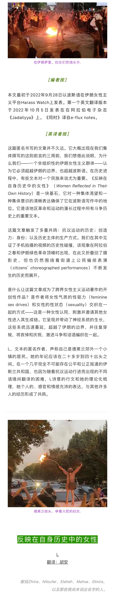

  

  

_音乐人Shervin Hajipour根据社交网络上人们_ ___＃为了___ _的发言创作了这首歌，__更多版本见__[《Bella Ciao Ciao Ciao！伊朗抵抗文艺——音乐篇》](http://mp.weixin.qq.com/s?__biz=Mzg3NjgyNDM5Nw==&mid=2247483985&idx=1&sn=10bf065897150ac1f378fd3587e50d87&chksm=cf2d1073f85a99658b970aab42be30e6126cdc8bfaffd3227502a10496cdb04dd771eb42cbec&scene=21#wechat_redirect)._

这个开源文档［https://pad.riseup.net/p/Women\_in\_the\_Reflection\_of\_their\_own\_History-keep］收集了对L文本的回复。它有助于这种日常的、持续的命名活动，在我们自己历史之镜中命名。这个文档邀请每个人把你自己的链接添加到这个由“Jian”驱动的链条中来，来丰富这些表达：你的经验，你的反应，以及用你自己的语言进行的翻译。

↓↓ 来源 

https://www.e-flux.com/notes/497512/women-reflected-in-their-own-history?fbclid=IwAR3Ojob9eknxeVsEiMqSm2VOZiAWAqOwntWxlHVTZ25HzuhDB8XDNXrJ-ZM

↓↓ 延伸阅读

___

［附录］

在“与此同时”的日常工作中，检索新闻事件时常会遇见一些细节丰富的材料，如宣言、书信、口述、视觉／文字／声音再创作、不同立场的批评，等等。这些是历史性的切面，也为对事件的理解提供了立体化的视角，据此，“与此同时”延伸出来“附录”栏目，意图为诸事件补充新闻性之外的细节、还原背景，以及激起和收集它们在简体中文世界的回响：同样可能是宣言、书信、口述、再创作和批评，形成对话、声援、致敬……有的来自我们的邀约，有的是自发的反馈。期待通过“附录”，我们能共同参与进一种更活泼、更生动的声场的搭建。

_↓↓_  _查看和订阅《同时》的邮件推送_
